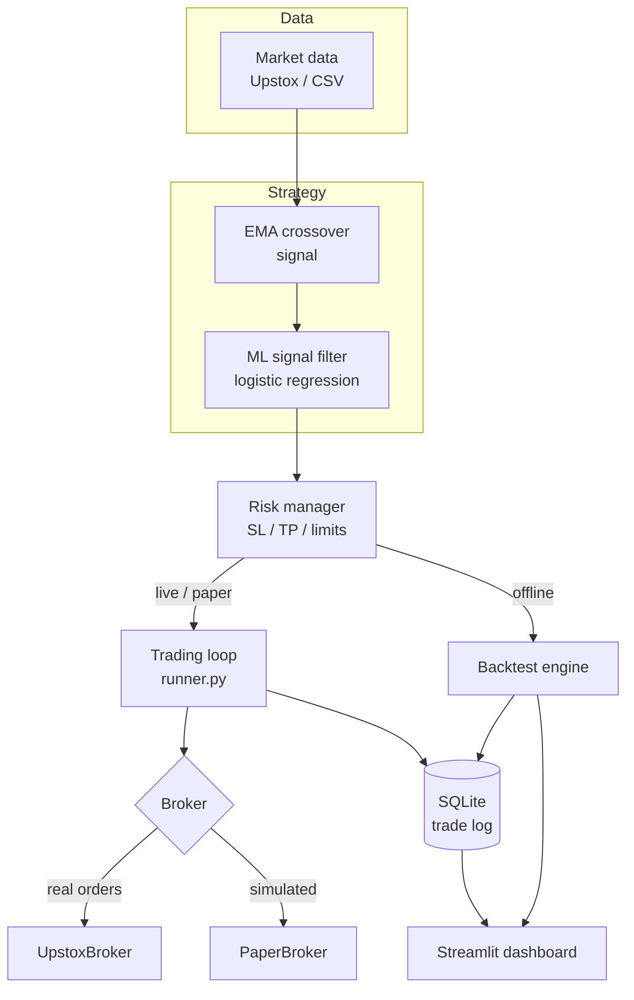

# Architecture

The system is a single Python package (`alphapulse`) with a thin Streamlit UI on top. The core
design principle: **the strategy and risk logic are written once and reused everywhere** — live
trading, paper trading, and backtesting all call the same functions.

## Data flow

## Modules

| Module | Responsibility |
|---|---|
| `config.py` | Typed, validated settings loaded from `.env` (pydantic-settings). |
| `broker/base.py` | The `Broker` interface the engine depends on. |
| `broker/upstox.py` | `UpstoxBroker` — real authentication, orders, and quotes. |
| `broker/paper.py` | `PaperBroker` — real prices, simulated fills, in-memory positions. |
| `data/market_data.py` | Fetch intraday candles from Upstox. |
| `data/loader.py` | Load historical candles from CSV for backtesting. |
| `strategy/indicators.py` | Reusable indicators: EMA, SMA, RSI, MACD, Bollinger Bands. |
| `strategy/ema_crossover.py`, `rsi_strategy.py`, `macd_strategy.py`, `bollinger_strategy.py` | The four strategies; each exposes `generate_signal(df)`. |
| `strategy/__init__.py` | Strategy registry (`STRATEGIES`, `get_strategy`) + `process_market_data`. |
| `strategy/features.py` | Technical features for the ML model (no look-ahead). |
| `strategy/ml_filter.py` | `MLSignalFilter` — gates any strategy's signals by predicted direction. |
| `risk/risk_manager.py` | `check_risk` + `RiskParams` — the risk rules. |
| `engine/backtest.py` | Offline simulation reusing the strategy + risk logic. |
| `engine/runner.py` | The live/paper trading loop. |
| `storage/db.py` | SQLite trade log. |
| `app/dashboard.py` | Streamlit UI. |

## Key design decisions

- **Broker abstraction** — the trading loop takes a `Broker`; swapping `UpstoxBroker` for
  `PaperBroker` switches between real and simulated execution with no other change.
- **No look-ahead in the backtest** — signals are computed only from candles up to and including
  the current bar; the ML target (next-candle direction) is used only during training.
- **Same risk logic in backtest and live** — `check_risk` drives both, with per-day resets and
  intraday square-off in the backtest to mirror live daily limits.
- **Offline-first dashboard** — the dashboard runs on committed sample data and the trained model,
  so it needs no broker connection and can be deployed publicly.
